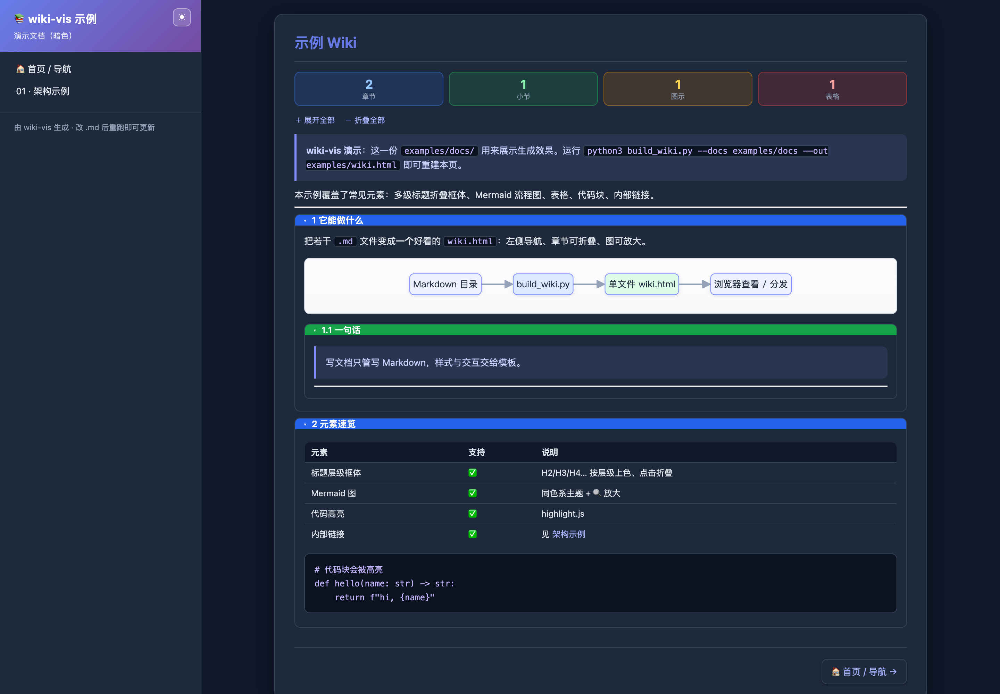

# wiki-vis

A **standard project-wiki solution**: let [Claude Code](https://claude.com/claude-code) analyze a codebase and author a multi-doc, diagram-rich wiki under `docs/`, then pack it into a single, self-contained, good-looking **`wiki.html`** — double-click to view, hand it to someone, or drop it on any static host. (It can also just convert existing Markdown.)

> Indigo-gradient + Tailwind-slate theme. Sidebar nav, heading-level collapsible section frames, Mermaid diagrams with image zoom, code highlighting. Works as a CLI tool **and** as a Claude Code Skill.

中文说明见 [README_cn.md](README_cn.md)。


*Light theme. A dark theme is built in too — toggle ☾/☀ in the header (persisted), or set the default at build time with `--theme dark`:*



---

## 🧭 Two modes

- **Author a project wiki (the main use)** — point Claude Code at a repo; it follows [`references/authoring-guide.md`](references/authoring-guide.md): recon → information architecture → diagram-first writing → lint → build → review. Produces a newcomer-friendly, heavily-diagrammed `docs/` set (flowcharts, E-R, sequence) and the HTML — including *how a multi-agent system is actually executed by Claude Code*.
- **Convert existing Markdown** — already have `docs/*.md`? Skip straight to the build commands below.

---

## ✨ Features

- **Sidebar navigation** + indigo-gradient brand header (Tailwind slate palette)
- **Section frames** — `H2/H3/H4…` automatically wrapped in solid-color title bars (blue / green / amber / red by depth), **click to collapse**, with expand/collapse-all
- **Top stat bar** — counts of sections / subsections / diagrams / tables
- **Mermaid diagrams** — themed to match the page + rounded shadow; every diagram gets a **🔍 zoom overlay** (wheel zoom, drag to pan, Esc to close)
- **Light / dark theme** — every wiki has a ☾/☀ toggle (persisted in `localStorage`); pick the default with `--theme light|dark|auto`. Code highlighting follows (github ↔ github-dark); Mermaid renders on a light panel that stays readable in both modes
- **Code highlighting** (highlight.js), styled tables and blockquotes
- **Internal `.md` links** rewired to in-page navigation; prev / next pager
- **Diagram quality gate** — `lint_mermaid.py` statically catches the Mermaid pitfalls that cause `Syntax error`; `check_render.py` renders every diagram via headless Chrome to catch the rest
- **Single-file output**, pure front-end, zero backend; the build script uses only the Python 3 standard library

---

## 🚀 Quick start

```bash
# Lint Mermaid first (optional but recommended), then build
python3 lint_mermaid.py docs/

# Auto mode: scan docs/, put README/index first, the rest sorted by filename
python3 build_wiki.py --docs docs --out wiki.html --lint

# Or drive it with a config file (order / titles / branding)
python3 build_wiki.py --config wiki.config.json --lint
```

Open it:

```bash
open wiki.html        # macOS
xdg-open wiki.html    # Linux
```

Try the bundled example:

```bash
python3 build_wiki.py --docs examples/docs --out examples/wiki.html
```

---

## ⚙️ Config file

`wiki.config.json` (every field optional; CLI flags win; full sample in [`references/wiki.config.example.json`](references/wiki.config.example.json)):

```json
{
  "title":    "Project Wiki",
  "brand":    "📚 Project Wiki",
  "subtitle": "Engineering docs · Knowledge base",
  "footer":   "Built with wiki-vis · edit .md and re-run to update",
  "docs":     "docs",
  "out":      "wiki.html",
  "pages": [
    { "file": "README.md",      "id": "home", "nav": "🏠 Home" },
    { "file": "01-overview.md", "id": "overview", "nav": "01 · Overview ⭐" }
  ]
}
```

Without `pages`, `*.md` files are auto-discovered. `pages[].nav` may contain emoji; `pages[].id` is used for anchors and internal-link routing (auto-derived if omitted).

CLI flags: `--docs --out --config --template --title --brand --subtitle --footer`.

---

## 🧩 Use as a Claude Code Skill

The repository root **is** a complete skill. Clone it straight into a skills directory:

```bash
# user-level (available across projects)
git clone https://github.com/yanqiyang62/wiki-vis.git ~/.claude/skills/wiki-vis
# or project-level
git clone https://github.com/yanqiyang62/wiki-vis.git .claude/skills/wiki-vis
```

Then just tell Claude "turn my docs into a wiki".

---

## 📦 Offline use

The template loads `marked` / `mermaid` / `highlight.js` from a CDN, so **viewing the page needs internet**. To go offline, download those three libraries, change the 4 CDN `src`/`href` in `template.html`'s `<head>` to local relative paths, and ship them alongside `wiki.html`.

---

## ⚠️ Mermaid gotchas (avoid `Syntax error`)

- To put a `"` inside node text use `#34;`, for `#` use `#35;` (`\` escaping does **not** work).
- For a dotted/labelled edge whose label contains `. / : ( )` etc., use the pipe form `A -.->|label| B` instead of `A -.label.-> B`.

---

## 🎨 Customize the look

Edit the `<style>` in `template.html`; design tokens live in `:root`:

```css
--c-primary:#667eea; --grad:linear-gradient(135deg,#667eea,#764ba2);  /* accent / gradient */
--c-bg:#f8f9fb; --c-text:#1e293b; --c-border:#e2e8f0; --radius:8px;
```

Per-level frame colors are in `.sec-l2/.sec-l3/.sec-l4/.sec-l5 > .sec-head { background:… }`.

---

## 📁 Layout

```
wiki-vis/
├── build_wiki.py                    # build: docs/*.md → wiki.html (Python 3 stdlib)
├── lint_mermaid.py                  # static Mermaid lint (file:line + fixes)
├── check_render.py                  # optional: render every diagram via headless Chrome
├── template.html                    # shell: CSS + JS engine + {{placeholders}}
├── SKILL.md                         # Claude Code skill manifest
├── references/
│   ├── authoring-guide.md           # project → multi-doc wiki workflow (the "brain")
│   └── wiki.config.example.json
├── examples/docs/                   # sample docs you can build immediately
└── assets/screenshot.png
```

## License

[MIT](LICENSE)
