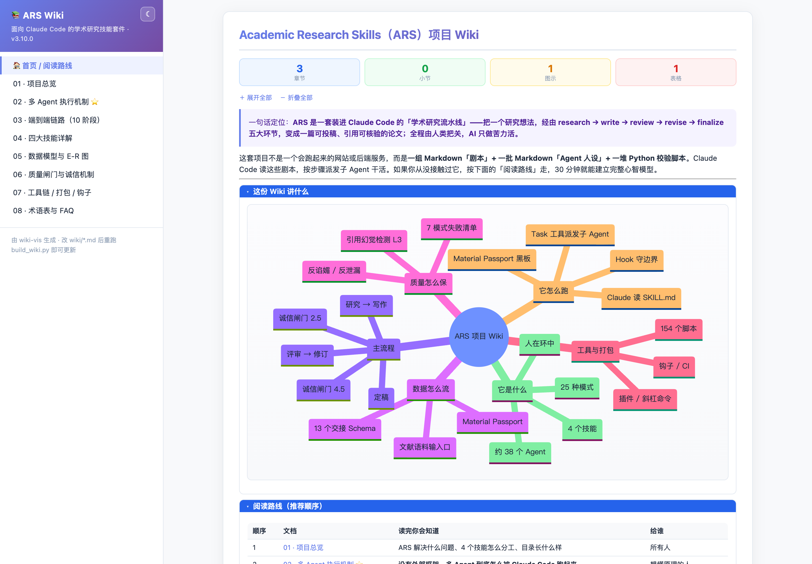

<div align="center">

# 📚 wiki-vis

**把一个代码项目，变成一个自包含、好看的单文件 `wiki.html`。**

面向 [Claude Code](https://claude.com/claude-code) 的标准项目 wiki 方案：分析仓库 → 在 `docs/` 写出多文档、多图的 wiki → 打包成一个 HTML 文件，双击即看、可分发、可丢到任意静态托管。*（也能直接转换现成的 Markdown。）*

[](LICENSE)
&nbsp;
&nbsp;
&nbsp;

[English](README.md) · **中文**

<picture>
  <source media="(prefers-color-scheme: dark)" srcset="assets/screenshot-dark.png">
  
</picture>

<sub>内置亮 / 暗双主题 —— 本图会跟随你的 GitHub 主题；生成的 wiki 里随时点 ☾/☀ 切换。</sub>

</div>

---

## ✨ 亮点

| | |
|---|---|
| 🧭 **两种用法** | 分析项目并**撰写**文档，或直接转换你已有的 Markdown |
| 🎨 **精致主题** | 紫靛渐变 + Tailwind slate，侧边栏导航，按标题层级**可折叠**的彩色章节框 |
| 📊 **统计条** | 章节 / 小节 / 图示 / 表格 实时计数 |
| 🖼️ **Mermaid** | 同色系主题 + **🔍 放大**浮层（滚轮缩放 · 拖拽平移 · Esc） |
| 🌗 **亮 / 暗** | ☾/☀ 切换，状态存 `localStorage`；默认主题用 `--theme light\|dark\|auto` |
| ✅ **图质量闸门** | `lint_mermaid.py` 抓 `Syntax error` 雷区；`check_render.py` 真渲染每张图兜底 |
| 📦 **单文件** | 纯前端、零后端；构建脚本**仅依赖 Python 3 标准库** |

---

## 🧭 两种用法

**1 · 给项目生成 wiki**（主场景）—— 把 Claude Code 指向一个仓库，它按 [`references/authoring-guide.md`](references/authoring-guide.md) 执行：

```
侦察 → 信息架构 → 图优先写作 → lint → 构建 → 质检
```

产出新人友好、图很多（流程图 / E-R / 时序）的 `docs/` 与 HTML —— 并讲清「**多 Agent 是怎么被 Claude Code 执行的**」。

**2 · 转换现成 Markdown** —— 已经有 `docs/*.md`？直接看下面的命令。

---

## 🛠 原理

简单说：`build_wiki.py` 把你的 `docs/*.md` 填进一个自包含模板（`template.html`），产出一个能自行在浏览器里渲染的 `wiki.html`。当 Claude Code 从项目生成 wiki 时，按一条简短流程走——读代码、定结构、图优先写作、lint、构建、质检，细节见 [`references/authoring-guide.md`](references/authoring-guide.md)。

---

## 🚀 快速开始

```bash
python3 lint_mermaid.py docs/                              # 1.（推荐）先校验，提前抓出坏图
python3 build_wiki.py --docs docs --out wiki.html --lint   # 2. 自动模式：README/index 置顶，其余按名排序
python3 build_wiki.py --config wiki.config.json --lint     #    …或用配置文件控制
open wiki.html            # macOS（Linux：xdg-open wiki.html）
```

几秒钟试一下自带示例：

```bash
python3 build_wiki.py --docs examples/docs --out examples/wiki.html --theme auto
```

---

## ⚙️ 配置

全部可选。**CLI 参数 > 配置文件 > 默认值**。

<details open>
<summary><b>CLI 参数</b></summary>

| 参数 | 含义 |
|---|---|
| `--docs DIR` | Markdown 目录（默认 `docs/`，不存在则用 `.`） |
| `--out FILE` | 输出文件（默认 `wiki.html`） |
| `--config FILE` | JSON 配置（见下） |
| `--theme light\|dark\|auto` | 默认主题（`auto` 跟随系统）；读者仍可切换 |
| `--lint` | 构建前跑 Mermaid 校验，发现 ERROR 即中止 |
| `--title / --brand / --subtitle / --footer` | 品牌文案 |
| `--template FILE` | 使用自定义模板壳 |

</details>

<details>
<summary><b>wiki.config.json</b>（完整示例见 <a href="references/wiki.config.example.json"><code>references/</code></a>）</summary>

```json
{
  "title":    "项目 Wiki",
  "brand":    "📚 项目 Wiki",
  "subtitle": "工程文档 · 知识库",
  "footer":   "由 wiki-vis 生成 · 改 .md 后重跑即可更新",
  "docs":     "docs",
  "out":      "wiki.html",
  "theme":    "auto",
  "pages": [
    { "file": "README.md",     "id": "home",     "nav": "🏠 首页 / 导航" },
    { "file": "01-架构设计.md", "id": "arch",     "nav": "01 · 架构设计 ⭐" }
  ]
}
```

未提供 `pages` 时自动发现 `*.md`。`pages[].nav` 可含 emoji；`pages[].id` 用于锚点与内部链接互跳（缺省自动推导）。

</details>

---

## 🧩 作为 Claude Code Skill 安装

本仓库根目录**就是**一个完整 skill —— 克隆进 skills 目录即可：

```bash
git clone https://github.com/yanqiyang62/wiki-vis.git ~/.claude/skills/wiki-vis      # 个人级（跨项目）
git clone https://github.com/yanqiyang62/wiki-vis.git .claude/skills/wiki-vis         # 或项目级
```

之后对 Claude 说一句「**把我的项目生成 wiki**」就行。

---

## 🖼️ Mermaid 小贴士（避免 `Syntax error`）

这两条 `lint_mermaid.py` 都会自动检查，一般无需死记：

- 节点文字里的 `"` 写成 `#34;`、`#` 写成 `#35;`（`\` 转义无效）。
- 带标签的边若标签含 `. / : ( )`，用管道写法 `A -.->|标签| B`，别用 `A -.标签.-> B`。

---

## 🎨 自定义主题

设计令牌都在 `template.html` 的 `:root`：

```css
--c-primary:#667eea;  --grad:linear-gradient(135deg,#667eea,#764ba2);   /* 主色 / 渐变 */
--c-bg:#f8f9fb;  --c-text:#1e293b;  --c-border:#e2e8f0;  --radius:8px;
```

章节顶条的层级配色在 `.sec-l2 / .sec-l3 / .sec-l4 / .sec-l5 > .sec-head`；暗色覆盖在 `html[data-theme="dark"]` 下。

---

## 📦 离线使用

模板从 CDN 加载 `marked` / `mermaid` / `highlight.js`，**查看时需联网**。要完全离线：把这三个库下载到本地，将 `template.html` `<head>` 里 4 个 CDN 的 `src`/`href` 改为随 `wiki.html` 一起分发的本地路径。

---

## 📁 目录结构

```
wiki-vis/
├── build_wiki.py                 # 构建：docs/*.md → wiki.html（纯 Python3 标准库）
├── lint_mermaid.py               # Mermaid 静态校验（file:line + 修复建议）
├── check_render.py               # 可选：无头 Chrome 真渲染每张图
├── template.html                 # 模板壳：CSS + JS 引擎 + {{占位符}}
├── SKILL.md                      # Claude Code skill 清单
├── references/
│   ├── authoring-guide.md        # 项目 → 多文档 wiki 工作流（写作层 / the brain）
│   └── wiki.config.example.json
├── examples/docs/                # 可直接构建的示例文档
└── assets/                       # 截图
```

---

<div align="center">
<sub>MIT © <a href="LICENSE">yanqiyang62</a> · made with <a href="https://claude.com/claude-code">Claude Code</a></sub>
</div>
