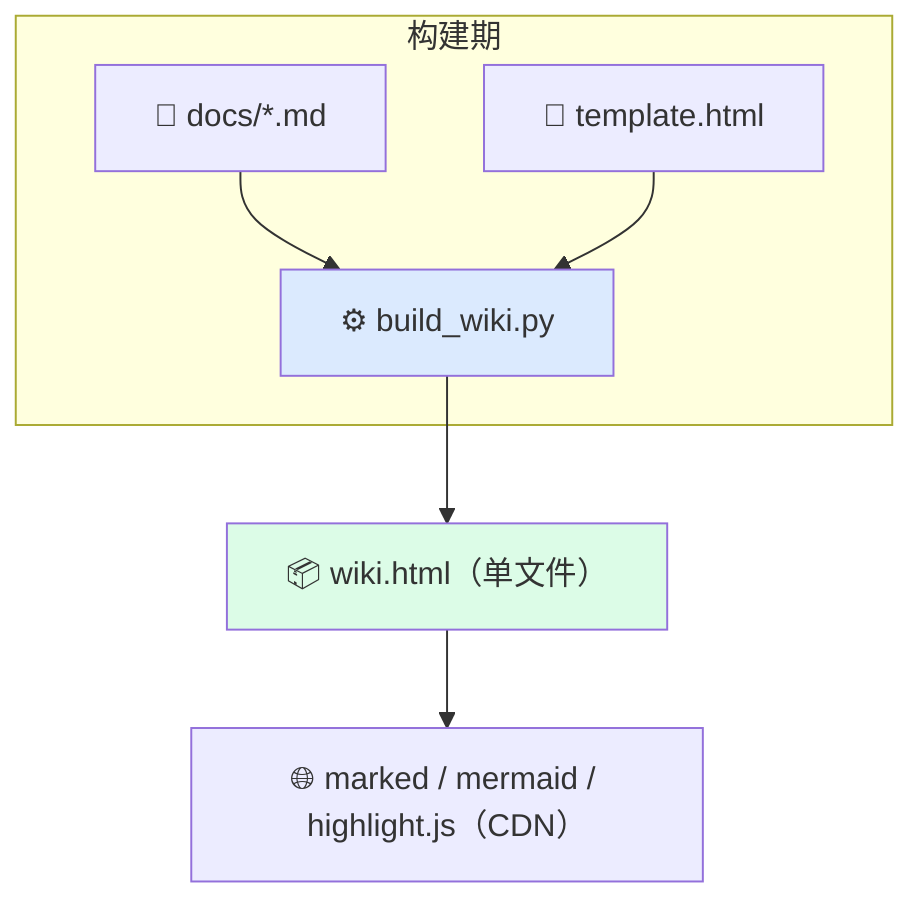
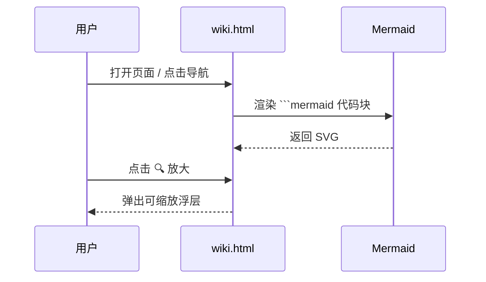

# 架构示例

演示一张稍复杂的图 + 时序图，方便检查 Mermaid 主题与放大功能。

## 1 组件关系

```mermaid
flowchart TB
    subgraph Build["构建期"]
        MD["📄 docs/*.md"] --> GEN["⚙️ build_wiki.py"]
        TPL["🧩 template.html"] --> GEN
    end
    GEN --> OUT["📦 wiki.html（单文件）"]
    OUT --> CDN["🌐 marked / mermaid / highlight.js（CDN）"]
    style GEN fill:#dbeafe
    style OUT fill:#dcfce7
```

## 2 查看期时序

```mermaid
sequenceDiagram
    participant U as 用户
    participant H as wiki.html
    participant M as Mermaid
    U->>H: 打开页面 / 点击导航
    H->>M: 渲染 ```mermaid 代码块
    M-->>H: 返回 SVG
    U->>H: 点击 🔍 放大
    H-->>U: 弹出可缩放浮层
```

## 3 返回

← 回到 [示例首页](README.md)
