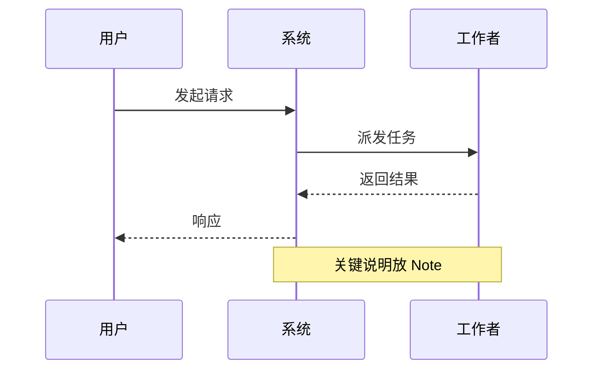
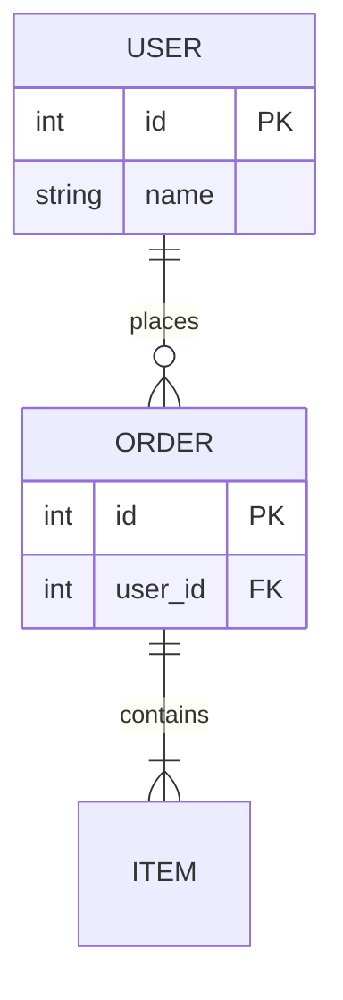
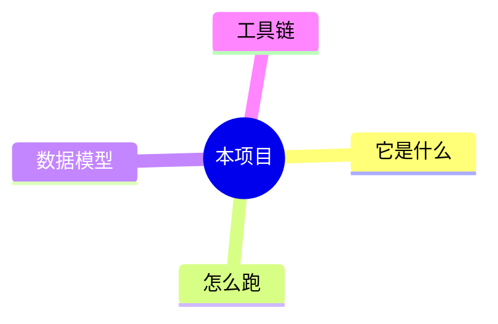
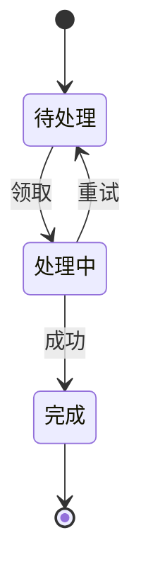
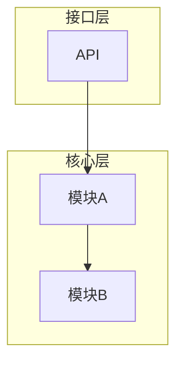
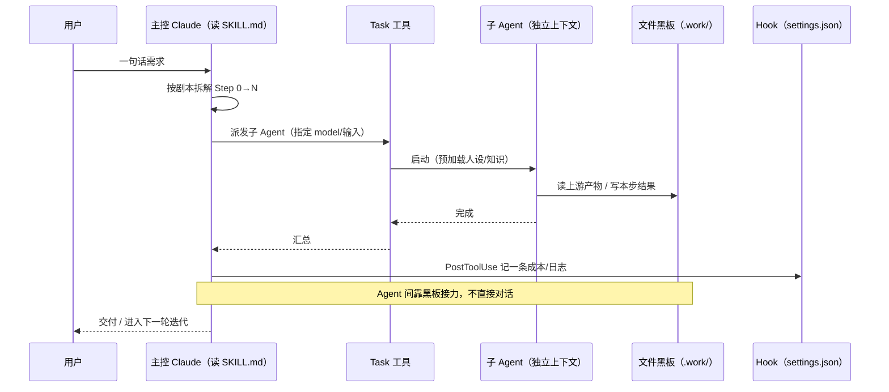

# wiki-vis 写作指南：从「读项目」到「高质量 HTML wiki」

> 本文是 **写作层**。当用户要「给项目生成 wiki / 梳理链路 / 标准项目 wiki」时，Claude 按此流程执行：
> **系统分析项目 → 在 `docs/` 写多文档（大量图）→ `lint` 校验 → `build_wiki.py` 出 HTML → 质检迭代**。
> 构建与样式细节见同目录 `../SKILL.md`。

---

## 0. 生成意图 / Definition of Done（默认目标，逐字保留）

> **docs 增加 wiki 文档，把当前项目链路流程梳理清晰，记录文档，包含流程图、e-r 关系图，解释清楚，任何一个不熟悉不了解本项目的人都能读懂项目。可以按模块多文档。尽量多图，可以生成 html 版本 wiki。标准的项目 wiki 方案。说清楚多 agent 是怎么被 Claude Code 执行的？**

判定「做完了」的硬标准：
- [ ] **新人可读**：完全不懂本项目的人，按阅读路线 30 分钟内能建立完整心智模型。
- [ ] **链路清晰**：端到端主流程（输入 → 处理 → 输出）有 Step-by-step + 至少一张总流程图。
- [ ] **图多且对**：平均每篇 ≥3 张图，每个大节 ≥1 张；类型用对（见 §4）；**全部能渲染**（`lint` + 渲染检查 0 报错）。
- [ ] **E-R 到位**：有数据模型/产物的项目，必须有 `erDiagram` 讲清实体与关系。
- [ ] **多 Agent 讲透**（若适用）：明确「多 Agent 是怎么被 Claude Code 执行的」（见 §5）。
- [ ] **按模块拆分**：复杂项目按模块多文档，互相 `.md` 链接。
- [ ] **产出 HTML**：`build_wiki.py` 生成 `wiki.html`，无 mermaid 报错。

---

## 1. 五阶段工作流

### P0 · 侦察（先读后写，禁止臆造）
目标：把项目的「是什么 / 怎么跑 / 数据长什么样 / 谁调谁」摸清。建议**并行**读（Explore/Task 分模块）。
- **全局**：`README*`、依赖清单（`package.json` / `pyproject.toml` / `go.mod` / `Cargo.toml` …）、`Makefile`/脚本、CI 配置、目录树。
- **入口与链路**：main/启动文件、路由表、CLI 定义、任务/队列、定时器；找出「一条请求/一次任务」从入口到产物的完整路径。
- **数据**：ORM models / `schema.sql` / migrations / proto / JSON schema / 关键配置文件 → 供 E-R 图。
- **Claude Code 多 Agent 项目**额外读（见 §5）：`.claude/agents/*.md`、`.claude/skills/*/SKILL.md`、`.claude/settings*.json`（hooks/权限）、运行时「文件黑板」目录、模型分层、计费/日志 hook。
- 产出：一张「事实清单」（模块、职责、依赖、数据实体、关键流程），后续每句话都要能落到代码。

### P1 · 信息架构（定骨架 + 配置）
按 §3 的标准骨架裁剪，复杂模块拆多篇。产出 `wiki.config.json`（顺序/标题/品牌），见 `wiki.config.example.json`。

### P2 · 图优先写作（核心）
**先画图，再写字**。每篇结构：一句话定位 → 总览图 → 分节（每节配图）→ 小结。
- 严格遵守 §4 的图模板与 §6 的雷区规则，**边写边自查**。
- 用 `> 提示/警告` 引用块、表格、`code` 增强可读性；面向「完全不懂的人」，术语首次出现即解释。
- 文档之间用相对 `.md` 链接（构建后自动变成站内跳转）。

### P3 · 构建（带闸门）
**先用 AskUserQuestion 问默认主题**：亮色 / 暗色 / 跟随系统 → 对应 `--theme light|dark|auto`（读者仍可在页面右上角 ☾/☀ 切换，Mermaid 会随主题重渲）。
```bash
python3 lint_mermaid.py docs/                                          # ① 静态校验，必过
python3 build_wiki.py --config wiki.config.json --theme <答案> --lint  # ② 构建（--lint 再兜底）
python3 check_render.py docs/                                          # ③ 可选：真渲染检查（需 Chrome）
```
`lint` 报 ERROR 必须先修；`build_wiki.py --lint` 发现 ERROR 会拒绝产出半成品。
> 暗色主题下 **Mermaid 图保持浅色面板（深字浅底）**，所以图里手写的 `style X fill:#浅色` 高亮在亮/暗下都清晰，放心用。

### P4 · 质检与迭代
- **对照代码 fact-check**：可调用 `fact-check` skill，确认文档与实现一致（别写代码里没有的东西）。
- **新人视角自查**：通篇能不能让外行看懂？有没有跳步？图是否解释了它该解释的？
- 截图预览（macOS）：`open wiki.html`，或无头截图见 SKILL.md。
- 发现问题回到 P2 修，重跑 P3。

---

## 2. 起手命令（在目标项目根目录）
```bash
mkdir -p docs
# …按 §3 写 docs/*.md 与 wiki.config.json…
python3 ~/.claude/skills/wiki-vis/lint_mermaid.py docs/
python3 ~/.claude/skills/wiki-vis/build_wiki.py --config wiki.config.json --lint
open wiki.html   # 预览
```

---

## 3. 标准文档骨架（默认 IA，按项目增删）

| 文件 | 内容 | 必备图 |
|---|---|---|
| `README.md` | 一句话定位 + 阅读路线 + 文档索引 | `mindmap` 或导览 `flowchart` |
| `01-项目总览.md` | 是什么 / 解决什么问题 / 顶层架构 / 目录结构 | 架构 `flowchart`/`graph` |
| `02-核心机制.md` ⭐ | 项目最关键的机制（如「多 Agent 如何被 Claude Code 执行」） | `sequenceDiagram` + `flowchart` |
| `03-端到端链路.md` | 主流程 Step-by-step、用户确认点、迭代回路 | 总 `flowchart` + 关键 `sequenceDiagram` |
| `04-模块详解.md`（可多篇） | 每个模块/组件：职责、输入输出、依赖、约束 | 每模块 1 张组件/流程图 |
| `05-数据模型与ER图.md` | 各数据实体/产物及其关系、字段说明 | `erDiagram`（必备） |
| `06-工具链与脚本.md` | 脚本 / CLI / 构建 / 校验工具 | 调用关系 `flowchart` |
| `07-运行部署与迭代.md` | 怎么跑起来、部署、增量迭代/改动流程 | 部署 `flowchart` + 状态机 |
| `08-术语表与FAQ.md` | 名词表 + 常见疑问 + 一页纸总结 | 一页纸 `mindmap`（可选） |

> 模块多就把 `04` 拆成 `04a-xxx.md`、`04b-xxx.md`…，在 `README` 和彼此间互链。

---

## 4. Mermaid 图谱（按用途选型 · 模板可直接粘贴）

所有模板均已遵守 §6 规则，可安全复制。

**流程 / 架构 — `flowchart`**


**交互 / Agent 派发 — `sequenceDiagram`**


**数据模型 — `erDiagram`**（关系动词不要带特殊字符）


**导览 — `mindmap`**


**状态 / 生命周期 — `stateDiagram-v2`**


**组件依赖 — `graph`（子图分组）**


---

## 5. 专题：如何讲清「多 Agent 是怎么被 Claude Code 执行的」

很多项目没有外部编排框架，多 Agent 全靠 **Claude Code 原生能力 + 文件约定 + Hook**。要讲清楚，去这些地方取证：

| 看什么 | 在哪 | 说明什么 |
|---|---|---|
| **Agent 定义** | `.claude/agents/*.md`（frontmatter：name/description/model/tools） | 有哪些专职子 Agent、各用什么档位模型、各自工具/人设 |
| **技能剧本** | `.claude/skills/*/SKILL.md` + `references/` | 主控 Claude 照哪个「剧本」分步执行、按需加载哪些细则 |
| **派发机制** | 剧本里的 Task/子 Agent 调用、并行写法 | 主控如何用 **Task 工具** 派发子 Agent；哪些并行 |
| **文件黑板** | 运行时工作目录（如 `.xxx-work/`） | Agent 间**不直接对话**，通过读写共享文件接力 |
| **Hook / 计费** | `.claude/settings*.json` 的 hooks（如 PostToolUse） | 每次派发触发的日志/成本/校验 hook |
| **模型分层** | 各 agent 的 `model:` 字段 | 重活用强模型、轻活用快模型的分工 |

**标准时序图模板**（按项目改角色名）：

配套再画一张 `flowchart` 展示 Step 0→N 的链路与确认点/迭代回路，效果最好。

---

## 6. Mermaid 雷区（写错就整图 `Syntax error`，务必遵守）

1. **节点文字里的引号**：要显示 `"` 用 `#34;`，要显示 `#` 用 `#35;`。**`\` 转义无效**。
   - ✗ `M["他说\"hi\""]`　✓ `M["他说#34;hi#34;"]`
2. **带标签的边**：标签含 `. / : ( ) " #` 时，**一律用管道写法**，别用内联：
   - ✗ `A -.确认点2.5.-> B`　✓ `A -.->|确认点2.5| B`
   - ✗ `A --(可选)--> B`　✓ `A -->|可选| B`
3. **关系动词/Note**：`erDiagram` 的关系名、`Note` 文本避免特殊符号。
4. **写完即校验**：`python3 lint_mermaid.py docs/`；ERROR 必须清零再构建。

> 经验法则：**只要边上要写字，默认用 `-->|标签|` / `-.->|标签|` 管道写法**，最稳。
